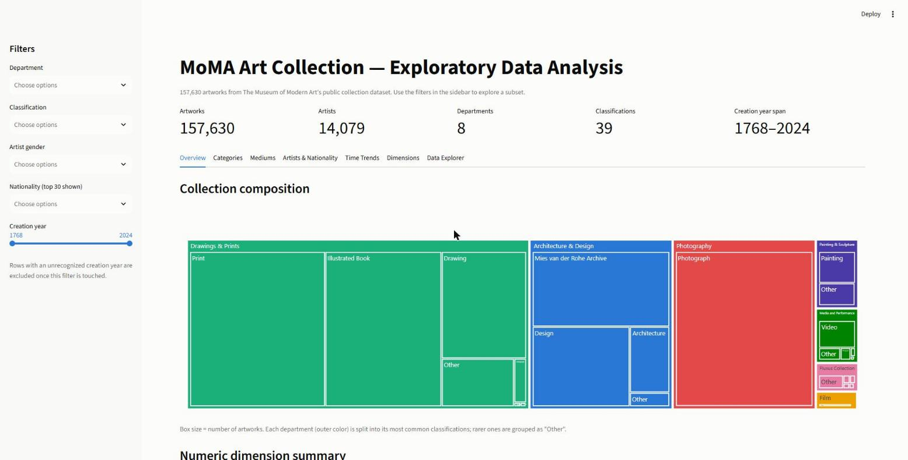
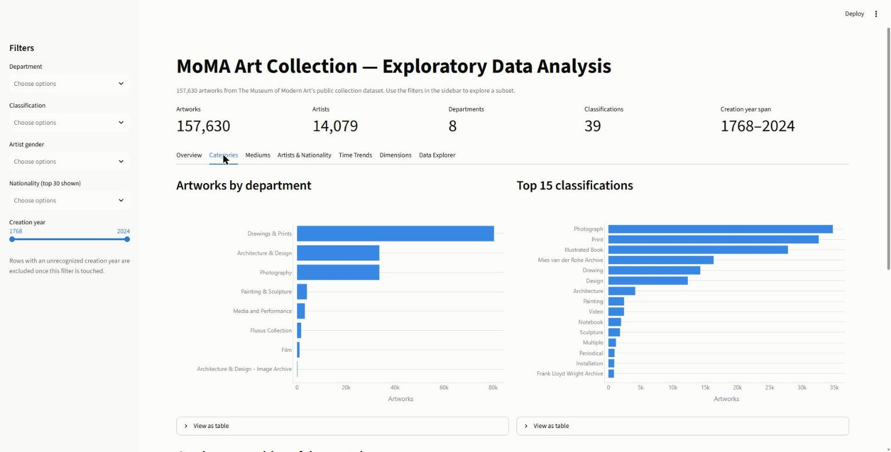
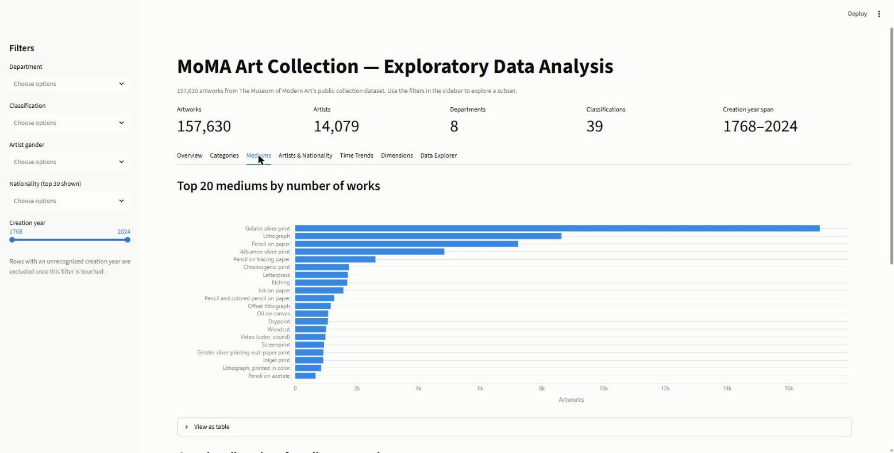
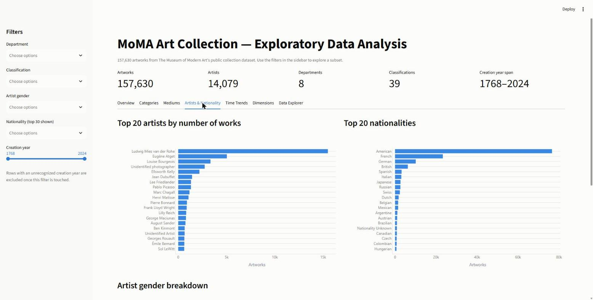
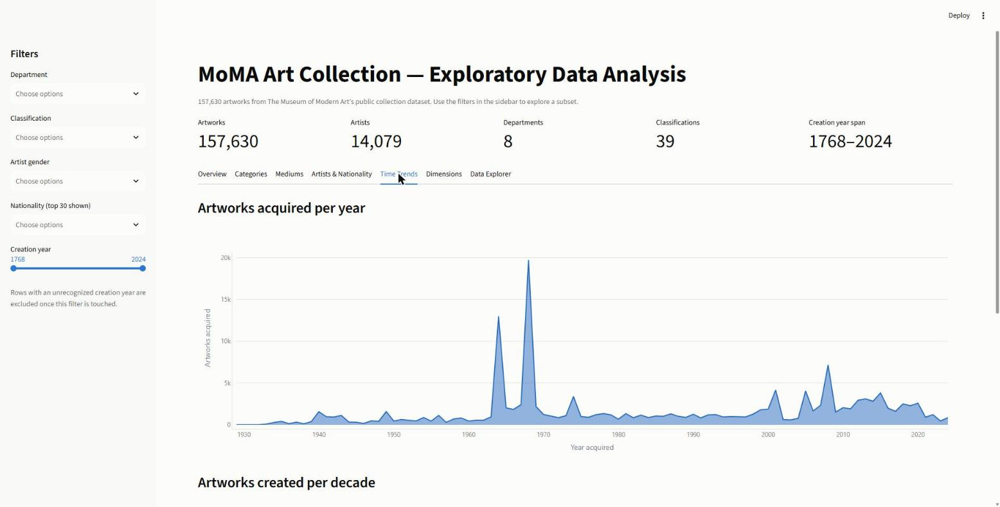
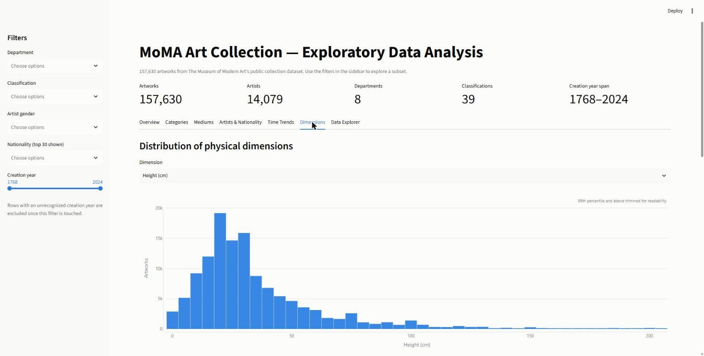
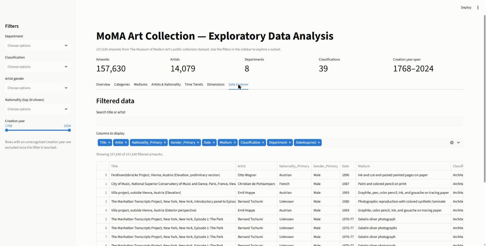

# MoMA Collection EDA

A Streamlit app for exploring The Museum of Modern Art's public art collection
dataset (`data/Artworks.csv`, ~157k artworks).

**Data Source:** [MoMA Art Collection Dataset](https://www.kaggle.com/datasets/lalit7881/the-museum-of-modern-art-moma-collection)
**Live app:** [moma-eda.streamlit.app](https://moma-eda.streamlit.app)

## Setup

Requires [uv](https://docs.astral.sh/uv/).

```bash
uv sync
```

## Run

```bash
uv run streamlit run app.py
```

This opens the app at `http://localhost:8501`.

## What's in the app

- **Overview** — a treemap of collection composition (department → top
  classifications) and summary stats for physical dimensions
- **Categories** — artworks by department/classification, gender mix by department
- **Mediums** — top mediums by number of works, and the growing diversity of
  distinct mediums used per decade
- **Artists & Nationality** — top artists, top nationalities, gender breakdown
- **Time Trends** — acquisitions per year, artworks created per decade
- **Dimensions** — height/width/weight distributions, a height-vs-width scatter
  by department, and a correlation heatmap
- **Data Explorer** — search, column picker, and CSV download of the filtered data

Sidebar filters (department, classification, artist gender, nationality, creation
year range) apply across every tab.

## Screenshots

**Overview**


**Categories**


**Mediums**


**Artists & Nationality**


**Time Trends**


**Dimensions**


**Data Explorer**

